## Arquitectura del Sistema Antifraude

El sistema antifraude está basado en una arquitectura de microservicios y donde cada microservicio esta construido con arquitectura hexagonal, emplea una estrategia de comunicación asíncrona basada en eventos usando Apache Kafka.

TransactionService: expone un endpoint REST para crear transacciones, las almacena en una base de datos PostgreSQL y publica un evento en Kafka cuando se crea una nueva transacción.

AntiFraudService: es un servicio sin endpoints REST, que escucha los eventos de transacciones nuevas desde Kafka. Evalúa si la transacción es fraudulenta y actualiza su estado mediante una llamada al TransactionService.

Esta arquitectura desacopla los servicios y permite escalar el antifraude sin afectar al sistema transaccional.


## Arquitectura del Sistema




## 🧩 Componentes

### TransactionService

- **Responsabilidades:**
  - Crear, consultar y actualizar transacciones.
  - Exponer una API REST.
  - Publicar eventos de creación de transacciones en Kafka.

- **Tecnologías:**
  - .NET 8
  - PostgreSQL
  - Entity Framework Core
  - Kafka (Confluent)
  - xUnit para pruebas

---

### AntiFraudService

- **Responsabilidades:**
  - Escuchar eventos de transacciones creadas.
  - Consultar el total diario de transacciones por cuenta.
  - Evaluar si una transacción debe ser aprobada o rechazada.
  - Actualizar el estado de la transacción en `TransactionService`.

- **Tecnologías:**
  - .NET 8 Worker Service
  - Kafka Consumer
  - Comunicación HTTP entre servicios

---

## 🚀 Endpoints REST

### TransactionService

| Método | Ruta                             | Descripción                                   |
|--------|----------------------------------|-----------------------------------------------|
| `POST` | `/transactions`                 | Crear una transacción                         |
| `GET`  | `/transactions/{id}`            | Consultar transacción por ID externo          |
| `GET`  | `/transactions/daily-total`     | Total diario por cuenta (`sourceAccountId`)   |
| `PUT`  | `/transactions/{id}/status`     | Actualizar estado de la transacción           |

---

## 🧪 Pruebas

- **Pruebas Unitarias** en:
  - `CreateTransactionUseCase`
  - `GetTransactionByIdUseCase`
  - `EvaluateTransactionUseCase`
  - `TransactionRepository`
- **Frameworks usados:**
  - `xUnit`
  - `Moq`
  - `Microsoft.EntityFrameworkCore.InMemory`

---

## 🐳 Docker

El archivo `docker-compose.yml` levanta los siguientes servicios:

- `postgres`: Base de datos PostgreSQL
- `kafka` y `zookeeper`: Sistema de mensajería distribuida

## 🛠️ Cómo correr localmente
Puedes correrlo con:

```bash
docker-compose up -d
```


Correr los servicios:
```
dotnet run --project src/TransactionService.Api
dotnet run --project src/AntiFraudService.Worker
```

Acceder a Swagger:
```
http://localhost:{puerto}/swagger
```

## 📂 Estructura del Proyecto
```
/TransactionService
  ├── Application
  ├── Domain
  ├── Infrastructure
  ├── Api
  └── UnitTests

/AntiFraudService
  ├── Application
  ├── Domain
  ├── Infrastructure
  ├── Worker
  └── UnitTests
```


## ✅ Checklist Funcional

- [x] Crear transacción (`POST /transactions`)
- [x] Consultar transacción (`GET /transactions/{id}`)
- [x] Obtener total diario (`GET /transactions/daily-total`)
- [x] Publicar evento en Kafka
- [x] Consumir evento desde AntiFraudService
- [x] Evaluar transacción
- [x] Consultar total diario desde AntiFraudService
- [x] Aprobar o rechazar transacción
- [x] Actualizar estado vía HTTP PUT
- [x] Pruebas unitarias
- [x] Diagrama de arquitectura
- [x] Docker Compose para infraestructura

